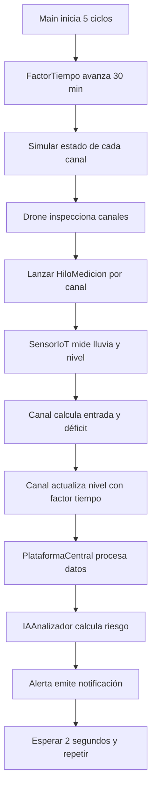

# Documentación — Boceto TGS

Sistema de monitoreo y alerta temprana de inundaciones para Cartagena de Indias.  
Este proyecto es un **boceto conceptual** que simula la arquitectura descrita en la propuesta del proyecto, aplicando la **Teoría General de Sistemas (TGS)**.

---

## 1. ¿Qué hace el sistema?

Simula el monitoreo de canales pluviales en zonas de Cartagena. En cada ciclo:

1. La lluvia varía con una función senoidal.
2. Cada canal simula si está normal, obstruido o roto.
3. Un hilo por canal mide datos y calcula si hay déficit de drenaje.
4. La plataforma central analiza el riesgo con IA y emite alertas.

No hay hardware real ni base de datos: todo se imprime en consola.

---

## 2. Relación con la TGS

El sistema se modela como subsistemas interconectados con retroalimentación:

| Subsistema TGS | Clases del boceto |
|----------------|-------------------|
| **Entrada** (monitoreo) | `Canal`, `SensorIoT`, `Drone`, `HiloMedicion` |
| **Procesamiento** (análisis) | `PlataformaCentral`, `IAAnalizador`, `DatosMonitoreo` |
| **Salida** (control/alertas) | `Alerta` |

El **factor tiempo** representa que el sistema evoluciona: si un canal no drena bien durante varios ciclos, el nivel de agua se acumula y el riesgo puede subir.

---

## 3. Estructura del proyecto

```
BocetoTGS/
├── pom.xml
├── DOCUMENTACION.md
└── src/main/java/org/eltrioquepesa/
    ├── Main.java                  → Punto de entrada, orquesta la simulación
    ├── model/
    │   ├── Canal.java             → Canal pluvial con sensor, drenaje y estado
    │   ├── SensorIoT.java         → Mide nivel de agua y lluvia
    │   ├── EstadoCanal.java       → Enum: NORMAL, OBSTRUIDO, ROTO
    │   ├── FactorTiempo.java      → Tiempo simulado por ciclo
    │   ├── HiloMedicion.java      → Hilo que mide y envía datos
    │   ├── DatosMonitoreo.java    → Paquete de datos de una medición
    │   ├── PlataformaCentral.java → Integra y procesa los datos
    │   ├── IAAnalizador.java      → Calcula nivel de riesgo
    │   ├── Alerta.java            → Emite alertas según el riesgo
    │   └── Drone.java             → Inspección visual de canales
    └── util/
        └── GeneradorDatos.java    → Helper para crear DatosMonitoreo
```

---

## 4. Flujo general de la simulación



### Paso a paso (`Main.java`)

1. Crea **3 canales** de Cartagena:
   - Canal Principal — El Pozón (capacidad 50)
   - Caño La María — Olaya Herrera (capacidad 35)
   - Canal Bocagrande — Bocagrande (capacidad 60)

2. Crea un **drone**, la **plataforma central** y el **factor tiempo** (30 min por ciclo).

3. Ejecuta **5 ciclos**. En cada uno:
   - Avanza el tiempo simulado.
   - Simula el estado de cada canal (normal / obstruido / roto).
   - El drone confirma si hay anomalía.
   - Lanza un **hilo de medición** por canal.
   - Espera a que todos los hilos terminen (`join()`).
   - Pausa 2 segundos antes del siguiente ciclo.

4. Al final imprime un resumen del nivel y estado de cada canal.

---

## 5. Clases en detalle

### `Canal`

Representa un canal pluvial donde está ubicado el sensor.

| Atributo | Descripción |
|----------|-------------|
| `nombre` | Nombre del canal |
| `zona` | Barrio/zona de Cartagena |
| `capacidadDrenaje` | Cuánta agua puede drenar en condiciones normales |
| `nivelAgua` | Nivel actual en metros (inicia en 1.0 m) |
| `estado` | NORMAL, OBSTRUIDO o ROTO |
| `sensor` | Sensor IoT instalado en el canal |

**`simularEstado()`** — Asigna aleatoriamente el estado:
- ~70% NORMAL
- ~20% OBSTRUIDO
- ~10% ROTO

**`getCapacidadEfectiva()`** — Capacidad real según el estado:
- NORMAL → 100% de la capacidad
- OBSTRUIDO → 30% de la capacidad
- ROTO → 0 (no drena)

**`calcularEntrada(lluvia)`** — Cuánta agua entra al canal:
```
entrada = (lluvia × 0.05) + (nivelAgua × 0.2)
```

**`calcularDeficit(entrada)`** — Agua que no se puede drenar:
```
déficit = max(0, entrada − capacidadEfectiva)
```

**`actualizarNivel(déficit, factorTiempo)`** — Sube el nivel si hay déficit:
```
nivelAgua += déficit × factorTiempo × 0.15
```

---

### `SensorIoT`

Sensor ultrasónico ubicado **dentro** de un `Canal`.

**`medirNivelAgua()`** — Devuelve el nivel actual del canal.

**`medirLluvia()`** — Simula la lluvia con una **función senoidal** (no es aleatoria):
```
lluvia = 150 × (sin(segundos × 0.4) + 1) / 2
```

- El resultado oscila entre **0 y 150 mm**.
- Sube hasta un pico y luego baja sola, como una tormenta.
- Todos los sensores comparten el mismo reloj (`inicio`), así que ven la misma lluvia al mismo tiempo.

---

### `FactorTiempo`

Representa el paso del tiempo en la simulación.

| Método | Qué devuelve | Uso |
|--------|--------------|-----|
| `avanzar()` | Suma 30 min al total | Se llama al inicio de cada ciclo |
| `getMinutosTotales()` | 30, 60, 90... | Se muestra en consola |
| `getMinutosCiclo()` | 30 | Se guarda en `DatosMonitoreo` |
| `getFactor()` | 0.5 (30 min en horas) | Se usa para actualizar el nivel de agua |

**Idea clave:** el déficit no sube el nivel al instante; el efecto depende de cuánto tiempo dura la situación.

---

### `HiloMedicion`

Implementa `Runnable`. Cada canal mide en su propio hilo:

1. Lee lluvia y nivel del sensor.
2. Calcula entrada y déficit del canal.
3. Actualiza el nivel de agua con el factor tiempo.
4. Crea un `DatosMonitoreo`.
5. Envía los datos a `PlataformaCentral`.

Los hilos se nombran `Hilo-Canal Principal`, `Hilo-Caño La María`, etc.

---

### `DatosMonitoreo`

Paquete con toda la información de una medición:

- Canal asociado
- Nivel de agua
- Lluvia
- Entrada de agua
- Déficit de drenaje
- Minutos del ciclo (factor tiempo)

Se imprime en consola con `toString()`.

---

### `PlataformaCentral`

Subsistema que **integra** todos los datos (núcleo del sistema según TGS).

- Recibe `DatosMonitoreo` desde los hilos.
- `procesar()` es `synchronized` para evitar conflictos cuando varios hilos escriben a la vez.
- Delega el análisis a `IAAnalizador` y las alertas a `Alerta`.

---

### `IAAnalizador`

Simula un modelo de IA que calcula riesgo con un sistema de puntos:

| Condición | Puntos |
|-----------|--------|
| Nivel de agua > 3.5 m | +30 |
| Lluvia > 80 mm | +30 |
| Déficit > 10 | +25 |
| Canal OBSTRUIDO | +15 |
| Canal ROTO | +25 |

| Puntaje total | Riesgo |
|---------------|--------|
| ≥ 80 | ALTO |
| ≥ 50 | MEDIO |
| < 50 | BAJO |

---

### `Alerta`

Subsistema de salida. Según el riesgo y los datos:

- Avisa si hay déficit de drenaje.
- Avisa si el canal está obstruido o roto.
- Emite alerta roja, amarilla o condiciones normales.
- En riesgo ALTO simula activar motobombas y notificar autoridades.

---

### `Drone`

Drone de reconocimiento visual. **`inspeccionarCanal()`** devuelve `true` si el canal no está en estado NORMAL. Confirma visualmente lo que ya simuló el canal.

---

### `EstadoCanal`

Enum con tres valores: `NORMAL`, `OBSTRUIDO`, `ROTO`.

---

### `GeneradorDatos`

Clase utilitaria que crea objetos `DatosMonitoreo`. No se usa directamente en `Main` (el hilo los crea), pero está disponible como helper.

---

## 6. Fórmulas resumen

```
Lluvia (mm)     = 150 × (sin(t × 0.4) + 1) / 2

Entrada         = lluvia × 0.05 + nivelAgua × 0.2

Cap. efectiva   = capacidadDrenaje × factorEstado
                  (NORMAL=1.0, OBSTRUIDO=0.3, ROTO=0)

Déficit         = max(0, entrada − cap. efectiva)

Nuevo nivel     = nivelAgua + déficit × (minutosCiclo/60) × 0.15
```

---

## 7. Ejemplo de salida en consola

```
=======================
SIMULACION #1
Tiempo transcurrido: 30 min
Lluvia actual: 42.3 mm
=======================
Drone DR-01 confirma anomalía en Caño La María -> OBSTRUIDO

===== DATOS RECIBIDOS [Hilo-Canal Principal] =====
Canal: Canal Principal (El Pozón) | Estado: NORMAL | Nivel Agua: 1.00 m | ...

Riesgo calculado: BAJO
Condiciones normales
```

---

## 8. Cómo ejecutar

Desde IntelliJ IDEA o cualquier IDE con JDK:

1. Abrir el proyecto `BocetoTGS`.
2. Ejecutar `org.eltrioquepesa.Main`.

Con Maven (si está instalado):

```bash
mvn compile exec:java -Dexec.mainClass="org.eltrioquepesa.Main"
```

---

## 9. Limitaciones del boceto

- No hay persistencia de datos ni interfaz gráfica.
- Las fórmulas son simplificadas, no modelos hidrológicos reales.
- La IA es un sistema de puntos, no machine learning.
- El estado del canal (roto/obstruido) sigue siendo aleatorio por ciclo.
- La lluvia senoidal y el factor tiempo usan relojes distintos (segundos reales vs. minutos simulados por ciclo).

Estas simplificaciones son intencionales: el objetivo es demostrar la **arquitectura TGS** y el flujo entre subsistemas, no una implementación de producción.

---

## 10. Autores

Proyecto de Teoría General de Sistemas — Ingeniería de Sistemas, Universidad de Cartagena.

- Luifer Camilo De Aguas Rivera
- Uber Andres Banquez Martinez
- Shaily Giselle Reales Acevedo
